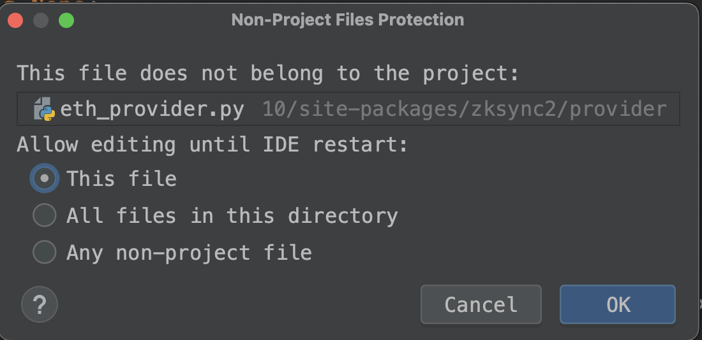

## ZkSync Era Network Batch Airdrop Script


## Feature
- [√] Batch of production wallets
- [√] Turn into ETH in batches through cross -chain
- [√] Transfer to ETH through OKX batch (recommended method)
- [√] Batch wallet operation -cross -chain (ETH-> ZKSYNC2)
- [√] Batch wallet operation-transfer
- [√] Batch wallet operation-deployment contract
- [√] Batch wallet operation -cross -chain (ZKSYNC2-> ETH)
- [] Batch wallet operation -SWAP
- [] Batch wallet operation -Mint NFT


## config
> `cp .env.example .env`


- ETH_URL: eth node url
- ZKSYNC_URL : zksync node url
- OKX_XX： (optional)
- 
```
# wallet private key
PRIVATE_KEY=xxx

# eth node url
# ETH_URL=https://rpc.ankr.com/eth_goerli
ETH_URL=

# zksync node url
# ZKSYNC_URL=https://zksync2-testnet.zksync.dev
ZKSYNC_URL=

# OKX api （optional）
OKX_API_KEY=ZKSYNC_URL
OKX_SECRET_KEY=xxx
OKX_PASS_PHRASE=xxx

```

## notice

If similar problems occur `Fail with error 'mv'`  during runing, you can modify the package and run again.




## Risk
- This project script is hosted on the world's largest github, open, transparent, and secure, and refuses any private chat scripts.
- The distribution of handling fees from the exchange in the script involves the exchange's apiKey, which must not be exposed to others.
- Private key accounts are very important! The script only runs on your own computer, and refuses any proxy interaction.