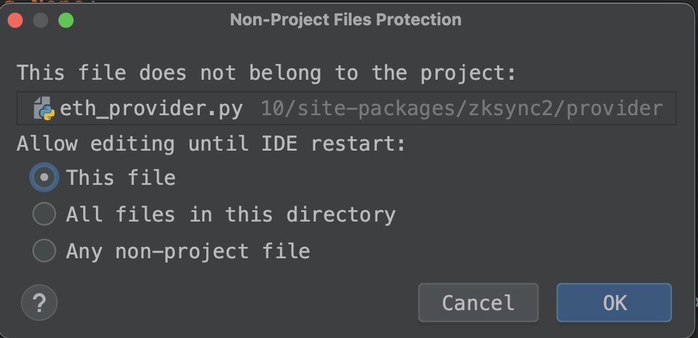
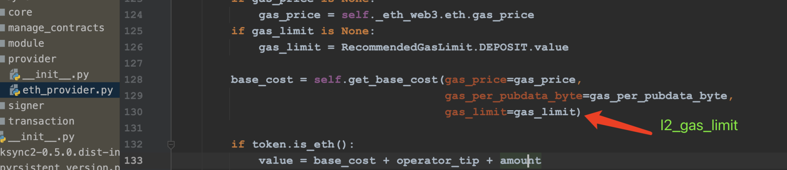

## ZkSync Era Network 批量交互脚本


## 基本功能
- [√] 批量生成钱包
- [√] 通过跨链(bridge.zksync.io)的方式批量转入ETH
- [√] 通过OKX批量转入ETH （推荐方式）
- [√] 批量钱包操作-跨链(ETH ->  zksync2)
- [√] 批量钱包操作-转账
- [√] 批量钱包操作-部署合约
- [√] 批量钱包操作-跨链(zksync2 -> ETH)
- [ ] 批量钱包操作-swap
- [ ] 批量钱包操作-mint NFT

## 配置
> `cp .env.example .env`


- ETH_URL: eth 节点 url
- ZKSYNC_URL : zksync 节点 url
- OKX_XX： 并不是必须得，用到再配置
```
# wallet private key
PRIVATE_KEY=xxx

# eth node url
# ETH_URL=https://rpc.ankr.com/eth_goerli
ETH_URL=

# zksync node url
# ZKSYNC_URL=https://zksync2-testnet.zksync.dev
ZKSYNC_URL=

# OKX api （optional）
OKX_API_KEY=ZKSYNC_URL
OKX_SECRET_KEY=xxx
OKX_PASS_PHRASE=xxx

```

## 运行问题

如果在运行过程中出现类似的问题' Fail with error 'mv' '，您可以修改包并重新运行。当时提了一个[PR](https://github.com/zksync-sdk/zksync2-python/pull/37#event-9583137191) ， 作者也做了合并，目前还没有发布新的版本。




## 风险
- 代码仅供交流使用，使用中任何资金风险概不负责；
- 请保管好自己的私钥，做好备份，防止丢失；